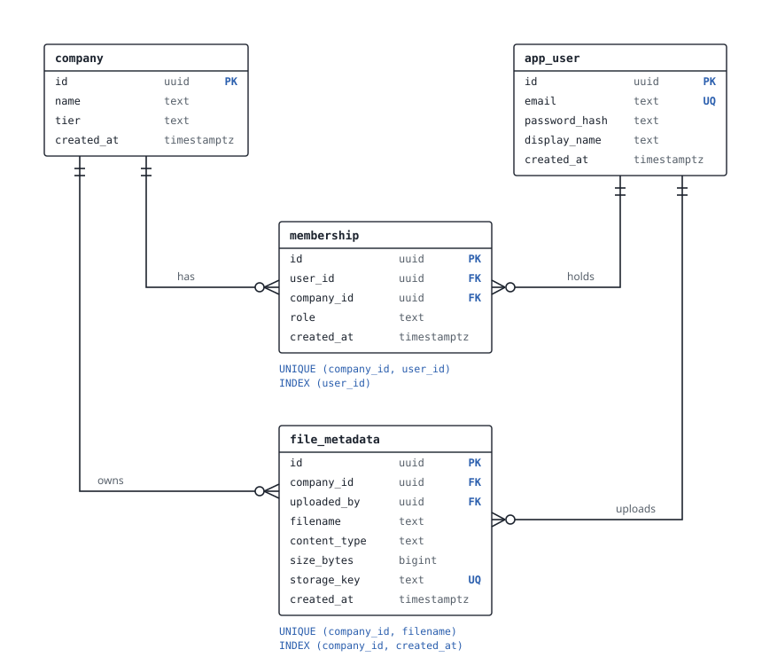
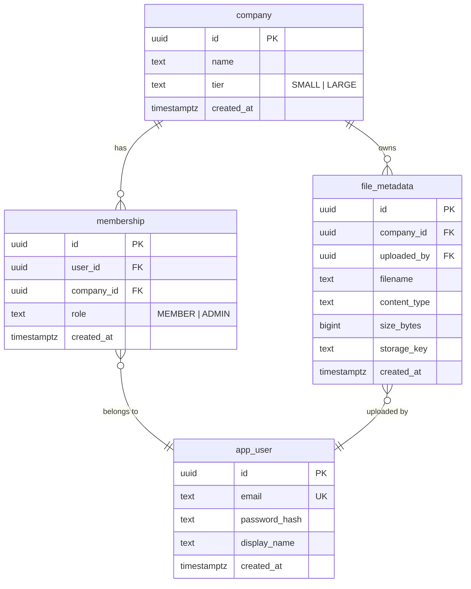

# TeamVault ERD

Hand-designed first, then captured here. Source of truth for the physical schema is the
Flyway migration (`backend/src/main/resources/db/migration/V1__init.sql`); this diagram
is the readable map. Tenant-isolation reasoning lives in
[ADR-003](adr/003-tenant-isolation-model.md).

Crow's foot notation: double tick = exactly one, circle + crow's foot = zero or many.

Mermaid source (editable mirror of the diagram)

## Constraints and indexes (the deliberate ones)

| Where | What | Why |
|---|---|---|
| `membership` | `UNIQUE (company_id, user_id)` | one membership per user per company; leading with `company_id`, its backing index also serves "members of company X" |
| `membership` | `INDEX (user_id)` | the reverse path, "companies of user Y", runs on every authenticated request; a composite index cannot serve both directions (leftmost prefix rule) |
| `file_metadata` | `UNIQUE (company_id, filename)` | filenames are unique per tenant, not globally |
| `file_metadata` | `UNIQUE (storage_key)` | exactly one metadata row per stored blob; duplicate keys would make blob deletion unsafe |
| `file_metadata` | `INDEX (company_id, created_at)` | the main listing query, "a company's files, newest first", is a range scan over that tenant's slice |
| `app_user` | `UNIQUE (email)` | login identity; globally unique because users exist independently of companies |

Every composite index on tenant-owned data leads with `company_id`: every access path
starts at the tenant boundary (ADR-003).
